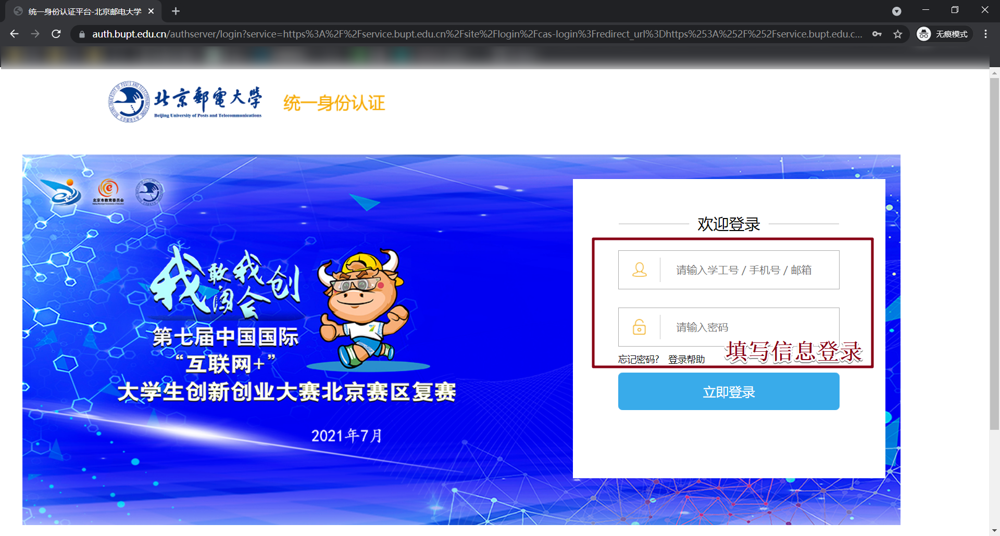

# BUPT-AutoLeave


✔IOS快捷方式链接请点[这里](https://www.icloud.com/shortcuts/27f5414e8f954714a4d271984f47cf43)

---

## 版本说明

- v1.0 可实现一键申请
  - 旨在以最快的速度完成申请认证
  - 为什么不设每日定时？- 模块化
  - 为什么要用cookie？ - 登录校网
  - 为何不用选择器？ - 太慢了

## 使用方法

🔊第一次设定时需要电脑一台。

### 获取cookie、辅导员信息

Step1：

用浏览器打开[网上服务大厅](https://service.bupt.edu.cn/v2/site/index)网址

自动跳转至统一身份认证，填写信息登录




Step2：

打开**开发者模式**，选择Network选项，对XHR进行筛选

Step3：

填表，所有都完成后点击上方的“保存草稿”按钮


Step4：

可以看到在出现名为“save-form-data-draft-apps”的内容。

Step5：

找到cookie和form_data。

格式示例：

**cookie**


```
PHPSESSID=ST-xxxxx-xxxxxxxx-xxxx-xxx-xxxxxxxxxxxx; vjuid=xxxxxx; vjvd=xxxxxxx; vt=xxxxx
```

**请将其完整复制下来**

在form_data中找到这几部分：

- 学院全称

  - 如：

    ```
    计算机学院（国家示范性软件学院）
    ```


- 辅导员信息

  - 如：

  - ```
    {"uid":12345,"name":"辅导员","number":"2010111111"}
    ```

    **需包含大括弧！！**

### 个人资料填写

0. 需要打开“允许不受信任的快捷指令”选项，才能自由的安装来自外部分享的快捷指令。路径为：设置–快捷指令–共享安全性–允许不受信任的快捷指令

1. 手机打开IOS快捷方式链接：[这里](https://www.icloud.com/shortcuts/27f5414e8f954714a4d271984f47cf43)

2. 选择添加不受信任的快捷指令

3. 

   填写相关个人信息，其中**辅导员信息**就是上一步中的**带括号的内容**，学院写全称。

4. 将cookie复制到这里👇

   

5. 设置已完成，可以选择“添加到主屏幕”实现一键式申请，或设置定时实现每日定时自动申请。


